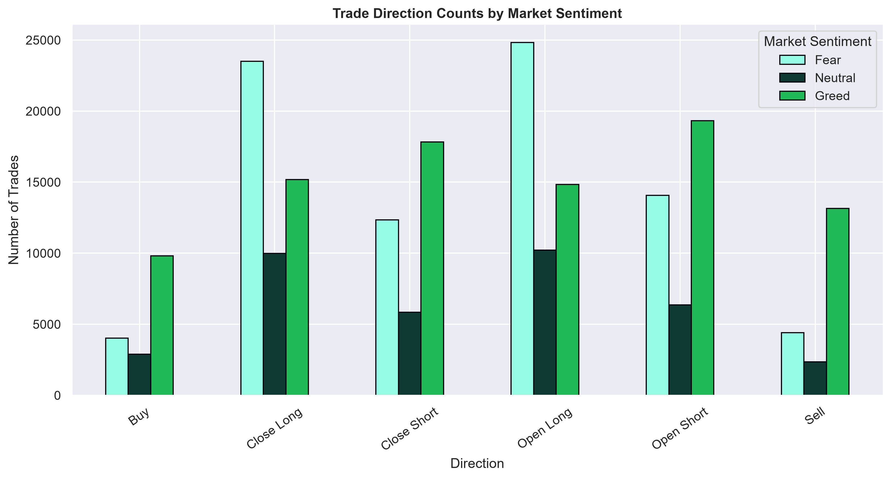

# Trading Behaviour Analysis

> Data Analytics Project | Hyperliquid Trading Data × Bitcoin Market Sentiment

A data-driven project exploring how trader behavior, profit outcomes, and risk patterns shift across Fear, Neutral, and Greed market conditions.

This project combines Bitcoin sentiment data with Hyperliquid trade-level data to analyze how market context relates to trading activity, trade size, realized PnL, and trading direction. The goal is not to predict the market, but to uncover behavioral patterns and measurable performance differences across sentiment regimes.

---

## 📌 Project at a Glance

| Metric | Value |
| --- | ---: |
| Total trades analyzed | 211,224 |
| Sentiment categories | Fear, Neutral, Greed |
| Main objective | Analyze behavior and performance by market sentiment |
| Primary tools | Python, Pandas, Matplotlib, Seaborn |
| Reporting output | PDF reports + notebook analysis |
| Data sources | Hyperliquid trade data + Bitcoin Fear & Greed index |

---

## 🎯 Business Problem

Crypto traders operate under changing market conditions. This analysis asks whether trading behavior and realized outcomes differ when sentiment is:

- 😨 Fear
- 😐 Neutral
- 😄 Greed

The project investigates how sentiment impacts:

- trader profitability
- trade size and frequency
- win rates and realized PnL
- spot vs. perpetual trading behavior
- position direction and trade execution patterns

---

## 🧠 What I Built

This project delivers a complete end-to-end analytics workflow:

1. Data ingestion and merging of market sentiment and trade data
2. Data cleaning and feature engineering for trading type and direction
3. Exploratory analysis across market sentiment conditions
4. Visual storytelling with charts and PDF reports
5. Summary insights suited for business and recruitment review

---

## 📊 Visual Overview

### Key charts from the project





---

## 🗂️ Project Structure

```text
ds_NaniBabu/
├── README.md
├── main.py
├── project.ipynb
├── transforme_df.py
├── univarient_analysis_report.py
├── bivarient_analysis_report.py
├── multivarient_analysis_report.py
├── hyperliquid_logo.webp
├── csv_files/
│   ├── fear_greed_index.csv
│   └── historical_data.csv
├── charts/
│   ├── chart_001.png
│   ├── chart_002.png
│   ├── chart_003.png
│   ├── chart_004.png
│   ├── chart_005.png
│   ├── chart_006.png
│   ├── chart_007.png
│   ├── chart_008.png
│   ├── chart_009.png
│   ├── chart_010.png
│   ├── chart_011.png
│   ├── chart_012.png
│   ├── chart_013.png
│   ├── chart_014.png
│   ├── chart_015.png
│   └── chart_016.png
├── reports/
│   ├── univarient_analysis_report.pdf
│   ├── bivarient_analysis_report.pdf
│   ├── multivarient_analysis_report.pdf
│   └── Trading_Behaviour_Analysis_Report.pdf
└── __pycache__/
```

> Small improvement note: the repository is structurally clean and easy to follow. If you want to polish it further for professional GitHub presentation, adding a `.gitignore` for `__pycache__/` and notebook artifacts would be a good next step. Also, `transforme_df.py` is functional, but `transform_df.py` would be clearer and more standard naming.

---

## 🧩 Script Breakdown

### `transforme_df.py`
This is the data preparation layer. It:

- loads the sentiment and trade datasets
- normalizes date fields
- filters valid trading directions
- merges the datasets on date
- creates derived features like `classification`, `trade_type`, `position_type`, and `proxy_name`
- prepares the clean DataFrame used across the analysis pipeline

### `univarient_analysis_report.py`
This script generates the univariate analysis report and focuses on:

- sentiment distribution
- trade size distribution
- realized PnL distribution
- profitable vs. loss trade counts
- spot vs. perpetual activity patterns

### `bivarient_analysis_report.py`
This script produces the bivariate analysis report and explores:

- realized PnL by sentiment
- trade size by sentiment
- profit and win rate differences across sentiment categories
- direction-based changes across sentiment conditions

### `multivarient_analysis_report.py`
This script generates the multivariate analysis report and highlights:

- realized PnL by sentiment and trade type
- win rate by sentiment and trade type
- outcomes tied to position closure strategies and direction

### `main.py`
This is the orchestration script that runs the full reporting pipeline and saves the generated PDF files into the `reports` directory.

---

## 📄 Generated Reports

The project produces the following PDF outputs:

- [reports/univarient_analysis_report.pdf](reports/univarient_analysis_report.pdf)
- [reports/bivarient_analysis_report.pdf](reports/bivarient_analysis_report.pdf)
- [reports/multivarient_analysis_report.pdf](reports/multivarient_analysis_report.pdf)
- [reports/Trading_Behaviour_Analysis_Report.pdf](reports/Trading_Behaviour_Analysis_Report.pdf)

These reports are designed for presentation and portfolio showcase, making the project easy to share with recruiters, interviewers, or stakeholders.

👉 Full detailed report: [Trading_Behaviour_Analysis_Report.pdf](reports/Trading_Behaviour_Analysis_Report.pdf)

---

## 🔍 Key Findings

### 📈 Trading activity by sentiment

| Sentiment | Total trade volume | Median trade size |
| --- | ---: | ---: |
| Fear | $596.77M | $749.58 |
| Neutral | $179.94M | $547.31 |
| Greed | $412.18M | $552.67 |

The data shows that trading volume and trade size are not uniform across sentiment regimes.

### 💰 Profitability and performance

| Sentiment | Mean realized PnL | Median realized PnL | Win rate |
| --- | ---: | ---: | ---: |
| Fear | $101.76 | $6.35 | 84.43% |
| Neutral | $71.27 | $4.58 | 82.40% |
| Greed | $104.80 | $6.49 | 82.45% |

The gap between mean and median realized PnL highlights the impact of large positive and negative outcomes, which is common in trading datasets.

### ⚠️ Risk and dispersion

- Fear: Standard deviation of realized PnL ≈ $1,420
- Neutral: Standard deviation of realized PnL ≈ $744
- Greed: Standard deviation of realized PnL ≈ $1,360

This suggests the highest profit/loss dispersion occurred during Fear and Greed periods.

### 🔀 Trading composition shifts by sentiment

- Fear and Neutral had larger shares in long-oriented positions.
- Greed showed a stronger tilt toward shorting behavior.
- Spot and Perpetual trading patterns also varied meaningfully by sentiment.

---

## 🛠️ Reproduce This Project

### 1) Clone the repository

```bash
git clone <your-repository-url>
cd ds_NaniBabu
```

### 2) Create a virtual environment

```bash
python -m venv .venv
```

On Windows:

```bash
.venv\Scripts\activate
```

On macOS/Linux:

```bash
source .venv/bin/activate
```

### 3) Install dependencies

```bash
python -m pip install --upgrade pip
pip install pandas matplotlib seaborn jupyter notebook pillow
```

### 4) Run the full workflow

```bash
python main.py
```

This will regenerate all the PDF reports inside the `reports/` folder.

### 5) Explore the notebook

```bash
jupyter notebook project.ipynb
```

---

## ✅ Skills Demonstrated

This project showcases strong capabilities in:

- data cleaning and preprocessing
- exploratory data analysis
- business-focused data storytelling
- statistical comparison across sentiment groups
- visualisation using Matplotlib and Seaborn
- documentation and report generation for presentation

---

## 🚀 Why This Project Stands Out

This is a strong candidate for a portfolio or recruiter-facing project because it combines:

- real market data
- behavioral analytics
- economic and sentiment context
- structured reporting
- polished visual communication

It demonstrates both technical execution and analytical thinking, which is especially relevant for data analyst and business intelligence roles.

---

## Contact

If you want, I can also help you convert this project into:

- a more polished GitHub homepage
- a stronger recruiter-focused project title and summary
- a 1-page portfolio-ready markdown version
- a technical case study write-up for LinkedIn or portfolio sites

             ▼               ▼
      Univariate EDA     Bivariate EDA
             │               │
             └───────┬───────┘
                     ▼
              Multivariate EDA
                     │
                     ▼
               Analysis Reports
                     │
                     ▼
             Key Insights & Conclusion
```

------------------------------------------------------------------------

## Project Structure

``` text
Trading-Behaviour-Analysis/
│
├── csv_files/
│   ├── fear_greed_index.csv
│   └── historical_data.csv
│
├── reports/
│   ├── univariate_analysis_report.pdf
│   ├── bivariate_analysis_report.pdf
│   └── multivariate_analysis_report.pdf
│
├── project.ipynb
│
├── transform_df.py
├── univariate_analysis_report.py
├── bivariate_analysis_report.py
├── multivariate_analysis_report.py
├── main.py
│
├── hyperliquid_logo.webp
├── Trading_Behaviour_Analysis_Report.pdf
└── README.md
```

### Role of each Python file

  -----------------------------------------------------------------------
  File                                Purpose
  ----------------------------------- -----------------------------------
  `project.ipynb`                     Initial exploratory analysis and
                                      experimentation

  `transform_df.py`                   Data cleaning, transformation,
                                      sentiment grouping, dataset
                                      preparation

  `univariate_analysis_report.py`     Generates univariate analysis and
                                      visualizations

  `bivariate_analysis_report.py`      Generates bivariate analysis and
                                      visualizations

  `multivariate_analysis_report.py`   Generates multivariate analysis and
                                      visualizations

  `main.py`                           Executes the complete analysis
                                      workflow

  `reports/`                          Stores generated analysis reports
  -----------------------------------------------------------------------

The project separates **data transformation** from the individual
analysis stages, making the workflow easier to maintain and rerun.

------------------------------------------------------------------------

## How to Run

Clone the repository and install the required Python libraries.

Then run the complete workflow from the project root:

``` bash
python main.py
```

`main.py` acts as the entry point and executes the transformation and
analysis scripts.

------------------------------------------------------------------------

## Tools & Technologies

**Programming & Analysis** - Python - Pandas - NumPy

**Visualization** - Matplotlib - Seaborn

**Analysis Techniques** - Data Cleaning & Transformation - Exploratory
Data Analysis - Univariate Analysis - Bivariate Analysis - Multivariate
Analysis - Distribution Analysis - Grouped Aggregation - Profitability
Analysis - Risk / Variability Analysis - Behavioural Analysis

**Output** - PDF analytical reports - Visualizations - Reproducible
Python workflow

------------------------------------------------------------------------

## Analytical Approach

The project follows a structured analytics workflow:

**Understand → Clean → Transform → Explore → Compare → Interpret**

Rather than treating a single metric as the answer, the analysis
combines:

-   **Volume** to understand trading activity
-   **Median and mean PnL** to understand realized outcomes
-   **Win rate** to compare profitable realized trades
-   **Standard deviation** to examine outcome variability
-   **Trade direction** to understand behavioural composition
-   **Trading type** to distinguish Spot and Perpetual activity
-   **Multivariate analysis** to examine how these dimensions interact

------------------------------------------------------------------------

## Important Interpretation Note

The analysis identifies **associations and observed patterns**, not
causal relationships.

For example, higher trading volume during Fear does not establish that
Fear caused traders to increase their trade sizes. Similarly,
differences in realized PnL across sentiment conditions should not be
interpreted as evidence that sentiment directly caused profitability
changes.

The findings describe patterns observed in the analyzed Hyperliquid
trading data after combining it with the daily sentiment classification.

------------------------------------------------------------------------

## Report

The complete analysis is documented in:

**`Trading_Behaviour_Analysis_Report.pdf`**

The report contains:

1.  Background
2.  Business Problem
3.  Dataset Description
4.  Methodology
5.  Exploratory Data Analysis
    -   Univariate Analysis
    -   Bivariate Analysis
    -   Multivariate Analysis
6.  Key Insights
7.  Conclusion

------------------------------------------------------------------------

## What This Project Demonstrates

This project demonstrates an end-to-end approach to a real-world style
data analytics problem:

-   Translating a business problem into analytical questions
-   Working with multiple datasets
-   Cleaning and transforming trade-level data
-   Joining datasets using date-based keys
-   Creating analytical features
-   Choosing visualizations based on analytical questions
-   Comparing distributions and aggregated metrics
-   Performing univariate, bivariate, and multivariate analysis
-   Interpreting results without overstating causality
-   Structuring analysis into reusable Python scripts
-   Building a reproducible analysis workflow

------------------------------------------------------------------------

## Author

**Nani Babu**

Data Analytics \| Python \| SQL \| Power BI \| Excel
