<div align="center">


# Trading Behaviour Analysis

**How trader behaviour, risk and performance change across Fear, Neutral and Greed market sentiment**


</div>

---

## 📋 Contents

**The report**
[Project at a Glance](#-project-at-a-glance) · [Background](#-background) · [Business Problem](#-business-problem) · [Objective](#-objective) · [Datasets](#-datasets) · [Methodology](#-methodology) · [Exploratory Data Analysis](#-exploratory-data-analysis) · [Key Insights](#-key-insights) · [Conclusion](#-conclusion) · [Interpretation Note](#-interpretation-note)

**The repository**
[Project Structure](#-project-structure) · [Script Breakdown](#-script-breakdown) · [Tools and Technologies](#-tools-and-technologies) · [How to Run](#-how-to-run) · [Reports](#-reports) · [Author](#-author)

---

## 📌 Project at a Glance

| | |
| --- | --- |
| **Question** | Does trader behaviour and performance change when the market is in Fear, Neutral or Greed? |
| **Trade data** | 211,224 Hyperliquid trades, 16 columns |
| **Sentiment data** | 2,644 daily Bitcoin Fear & Greed records, 4 columns |
| **Sentiment groups** | Fear, Neutral, Greed |
| **Trading types** | Spot and Perpetual |
| **Analysis** | Univariate, bivariate and multivariate EDA |
| **Tools** | Python, Pandas, NumPy, Matplotlib, Seaborn |
| **Output** | Three PDF analysis reports plus one full written report |

---

## 🏦 Background

Hyperliquid is a cryptocurrency trading platform where users buy and sell digital assets and trade on their expected price movements. It offers two kinds of trading.

| 🪙 Spot trading | 📈 Perpetual trading |
| --- | --- |
| Traders directly buy or sell a cryptocurrency at its current market price. Buying Bitcoin means the trader actually holds Bitcoin and can sell it later. | Traders don't buy the coin. They take a position on whether the price will rise (**Long**) or fall (**Short**). Unlike regular futures, perpetual trades have no fixed expiry date. |

---

## ❓ Business Problem

Crypto traders operate under changing market sentiment, from Fear to Greed. It isn't clear whether they change their behaviour, or get different outcomes, under different sentiment conditions.

This analysis looks at:

- How does market sentiment relate to trader profitability?
- Do trading activity and trade size change across Fear, Neutral and Greed?
- Does risk-taking differ across sentiment conditions?
- Are traders more successful when their behaviour aligns with, or diverges from, market sentiment?
- Are there behavioural patterns linked to better or worse outcomes?

The goal is not to predict the market. It is to find meaningful relationships between sentiment, behaviour, risk and outcomes.

---

## 🎯 Objective

To analyse how trader behaviour and performance vary across **Fear, Neutral and Greed** by looking at profitability, risk, trading activity, trade size and trading direction, and to identify the behavioural patterns linked to differences in outcomes.

> **In simple words:** when the market is Fearful, Neutral or Greedy, how does trader behaviour change, and does that behaviour relate to different trading outcomes?

---

## 📂 Datasets

Two datasets are combined on date, so each trade carries the sentiment of the day it was made.

### 1. Bitcoin Market Sentiment

2,644 records · 4 columns · one record per day

| Column | Type | Description | Example |
| --- | --- | --- | --- |
| `timestamp` | Integer | Unix timestamp of the date | 1733961600 |
| `value` | Integer | Fear & Greed score from 0 to 100 | 75 |
| `classification` | String | Sentiment category based on the score | Fear, Neutral, Greed |
| `date` | String | Human-readable date | 2024-12-12 |

### 2. Hyperliquid Trading Data

211,224 records · 16 columns · one row per trade

<details>
<summary><b>Column details (click to expand)</b></summary>

| Column | Type | Description | Example |
| --- | --- | --- | --- |
| `Account` | String | Unique trader wallet address | 0x1234...abcd |
| `Coin` | String | Cryptocurrency being traded | BTC, ETH, SOL |
| `Execution Price` | Float | Price at which the trade was executed | 43250.50 |
| `Size Tokens` | Float | Number of tokens traded | 0.5 |
| `Size USD` | Float | Dollar value of the trade | 21625.25 |
| `Side` | String | Buy or Sell | Buy |
| `Timestamp IST` | String | Date and time of the trade in IST | 2024-01-15 14:30:22 |
| `Start Position` | Float | Position size before the trade | 1.2 |
| `Direction` | String | Type of position action | Open, Close |
| `Closed PnL` | Float | Profit or loss realized from the trade | 150.75, -45.20 |
| `Transaction Hash` | String | Blockchain transaction identifier | 0xabc123... |
| `Order ID` | Integer | Unique identifier for the order | 123456 |
| `Crossed` | Boolean | Whether the order crossed the spread | True / False |
| `Fee` | Float | Trading fee for the trade | 2.50 |
| `Trade ID` | Float | Unique identifier for the trade | 789012.0 |
| `Timestamp` | Float | Unix timestamp of the trade | 1705318822.0 |

</details>

---

## 🧹 Methodology

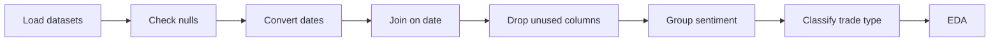

**Approach:** Understand → Clean → Transform → Explore → Compare → Interpret

### Data extraction

- Loaded both datasets into Pandas DataFrames.
- Checked every column for null values to spot incomplete records.

### Data wrangling

| Step | What was done |
| --- | --- |
| Convert dates | The `date` column in both DataFrames was a string. It was converted to Pandas datetime so the datasets could be joined. |
| Join | Sentiment and trade DataFrames were joined on `date`, so each trade has its day's sentiment. |
| Drop columns | Removed `timestamp`, `Order ID`, `Transaction Hash`, `Trade ID` and `Timestamp`. They aren't needed for the behaviour and performance analysis. |
| Group sentiment | Five original categories were grouped into three (table below). |
| Classify trade type | New `trade_type` column from `Direction`: **Buy** and **Sell** are Spot. Other directions, such as Close Long and Open Short, are Perpetual. |

| Original category | Grouped category |
| --- | --- |
| Extreme Fear | Fear |
| Fear | Fear |
| Neutral | Neutral |
| Greed | Greed |
| Extreme Greed | Greed |

---

## 📊 Exploratory Data Analysis

### 🔹 Univariate analysis

Each variable was examined on its own, with the chart type chosen to fit the question.

#### 1. Market sentiment distribution

Pie chart, to show the share of each sentiment category.

<p align="center">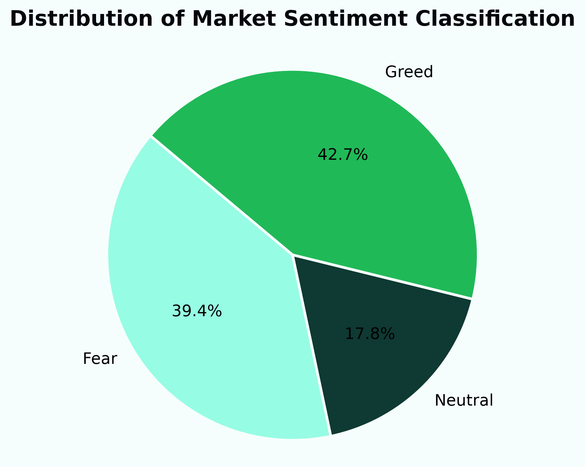</p>

Greed is the largest group at **42.7%**, followed by Fear at **39.4%** and Neutral at **17.8%**.

#### 2. Trade size (USD)

Histogram on a log x-axis. `Size USD` is the notional value of a trade.

<p align="center">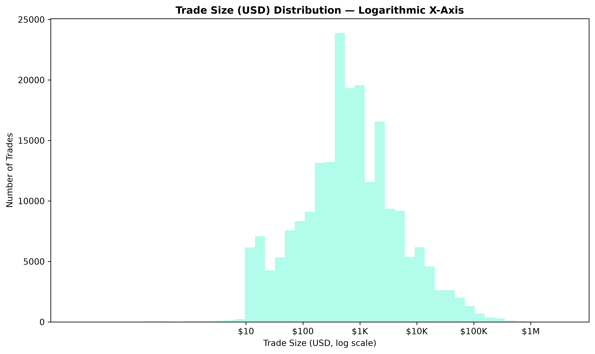</p>

<details>
<summary><b>Summary statistics</b></summary>

| Statistic | Value |
| --- | ---: |
| Median | $597.28 |
| Mean | $5,636.17 |
| Standard deviation | $36,588.16 |
| 25th percentile | $194.00 |
| 75th percentile | $2,058.51 |
| 95th percentile | $20,012.74 |
| 99th percentile | $88,887.23 |
| Maximum | $3,921,430.72 |

</details>

Trade size is strongly right-skewed. The median is $597.28 but the mean is $5,636.17, pulled up by a small number of very large trades, the biggest reaching $3.92 million.

#### 3. Realized PnL

Histogram on a symmetric log scale. Trades with `Closed PnL = 0` were excluded first, because they are opens that haven't produced a realized outcome.

<p align="center">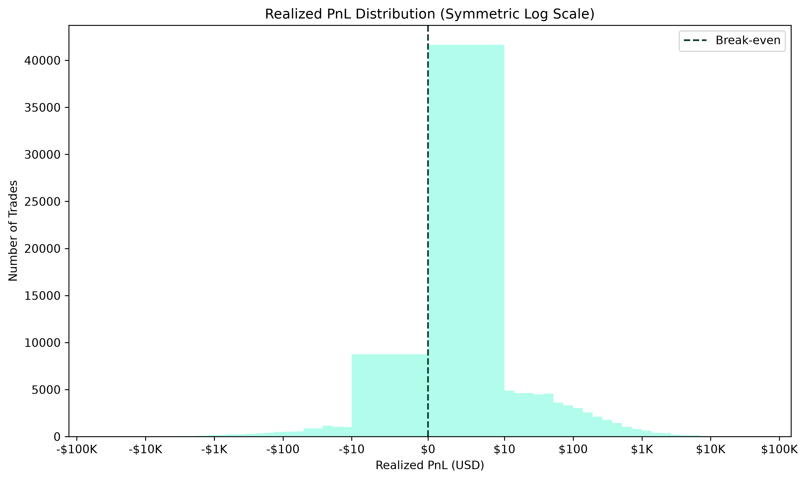</p>

<details>
<summary><b>Summary statistics</b></summary>

| Statistic | Value |
| --- | ---: |
| Mean | $97.80 |
| Median | $6.05 |
| Standard deviation | $1,299.45 |
| Minimum | -$117,990.10 |
| 25th percentile | $0.41 |
| 75th percentile | $38.18 |
| 90th percentile | $168.03 |
| 95th percentile | $392.68 |
| 99th percentile | $1,965.34 |
| Maximum | $135,329.09 |
| Skewness | 21.85 |
| Kurtosis | 3,225.92 |

</details>

Most values sit close to zero, with a long tail of large profits and losses. The mean ($97.80) is far above the median ($6.05), so large outcomes drive the average.

#### 4. Profitable vs. loss trades

Bar chart.

<p align="center">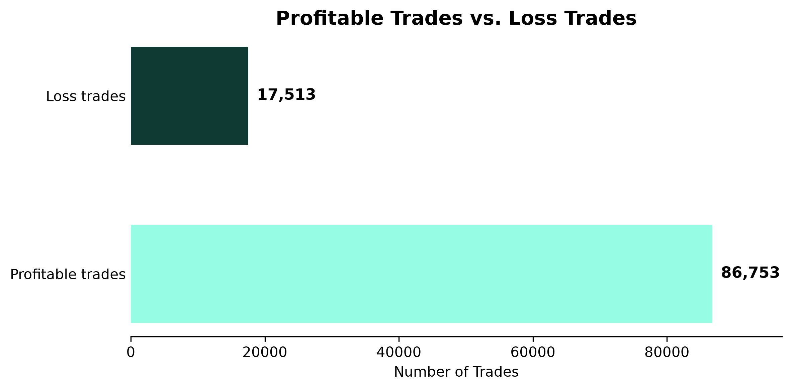</p>

**86,753** profitable trades against **17,513** loss trades.

#### 5. Trades by trading type

Bar chart.

<p align="center">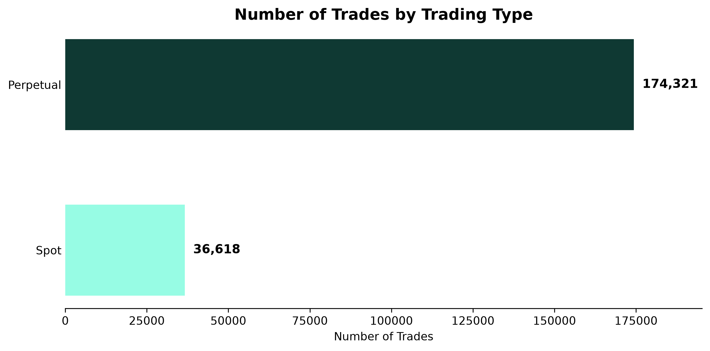</p>

**174,321** Perpetual trades against **36,618** Spot trades. Perpetual is the majority of activity.

### 🔹 Bivariate analysis

Two variables at a time, with sentiment as the comparison axis.

#### 1. Profitability vs. sentiment

| Sentiment | Mean realized PnL | Median realized PnL | Win rate |
| --- | ---: | ---: | ---: |
| Fear | $101.76 | $6.35 | 84.43% |
| Neutral | $71.27 | $4.58 | 82.40% |
| Greed | $104.80 | $6.49 | 82.45% |

Means are much higher than medians in all three groups, so large trades and extreme outcomes influence the average. Win rates are close, with Fear slightly higher.

#### 2. Trade size vs. sentiment

| Sentiment | Total trade volume | Mean trade size | Median trade size |
| --- | ---: | ---: | ---: |
| Fear | $596.77M | $7,177.14 | $749.58 |
| Neutral | $179.94M | $4,779.42 | $547.31 |
| Greed | $412.18M | $4,572.56 | $552.67 |

Fear has the highest total volume, mean and median trade size. Neutral and Greed medians are close. The median is the better read of a typical trade, since large trades pull the means up.

#### 3. Risk vs. sentiment

Risk is measured as the standard deviation of realized PnL, with box plots for the spread.

<p align="center">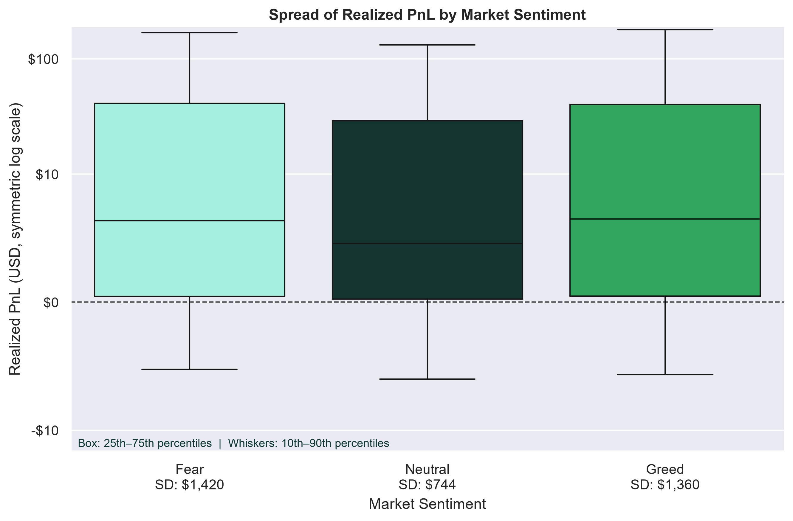</p>

| Sentiment | Std. dev. of realized PnL |
| --- | ---: |
| Fear | ≈ $1,420 |
| Neutral | ≈ $744 |
| Greed | ≈ $1,360 |

Outcomes are most spread out in Fear and Greed, and noticeably tighter in Neutral.

#### 4. Trade direction vs. sentiment

Direction counts were converted to percentages within each sentiment, shown as one pie per sentiment.

<p align="center">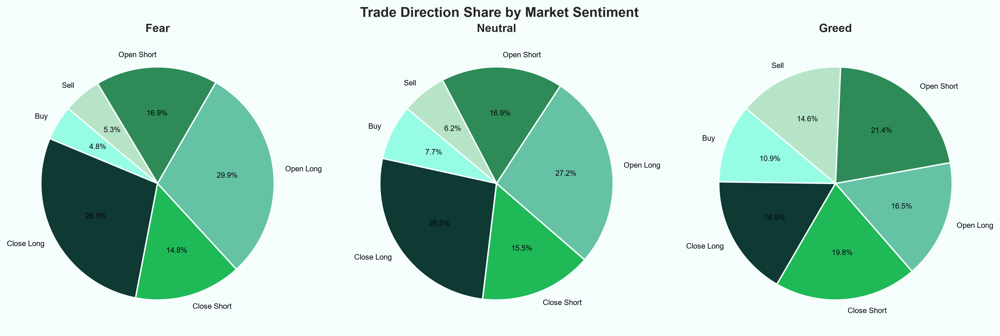</p>

| Sentiment | Open Long | Close Long | Open Short | Close Short | Buy | Sell |
| --- | ---: | ---: | ---: | ---: | ---: | ---: |
| Fear | 29.9% | 28.3% | 16.9% | 14.8% | 4.8% | 5.3% |
| Neutral | 27.2% | 26.5% | 16.9% | 15.5% | 7.7% | 6.2% |
| Greed | 16.5% | 16.8% | 21.4% | 19.8% | 10.9% | 14.6% |

Long actions take the larger share in Fear and Neutral. In Greed, Short actions take the larger combined share.

### 🔹 Multivariate analysis

Three or more variables together, to see how they interact.

#### 1. Sentiment × trading type × performance

Box plots for the PnL distribution and a heatmap for win rate.

<p align="center">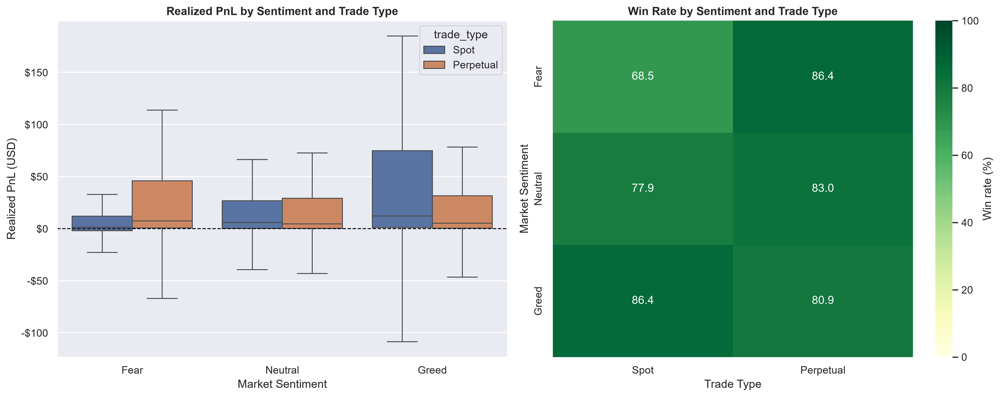</p>

| Sentiment | Spot median PnL | Spot win rate | Perpetual median PnL | Perpetual win rate |
| --- | ---: | ---: | ---: | ---: |
| Fear | $1.25 | 68.46% | $7.33 | 86.36% |
| Neutral | $5.72 | 77.89% | $4.41 | 83.05% |
| Greed | $12.13 | 86.44% | $5.21 | 80.88% |

Perpetual has the higher win rate in Fear and Neutral. Spot has the higher win rate in Greed.

#### 2. Position direction × sentiment × realized PnL

Box plots for Close Long, Close Short and Sell, since realized PnL is produced when positions close.

<p align="center">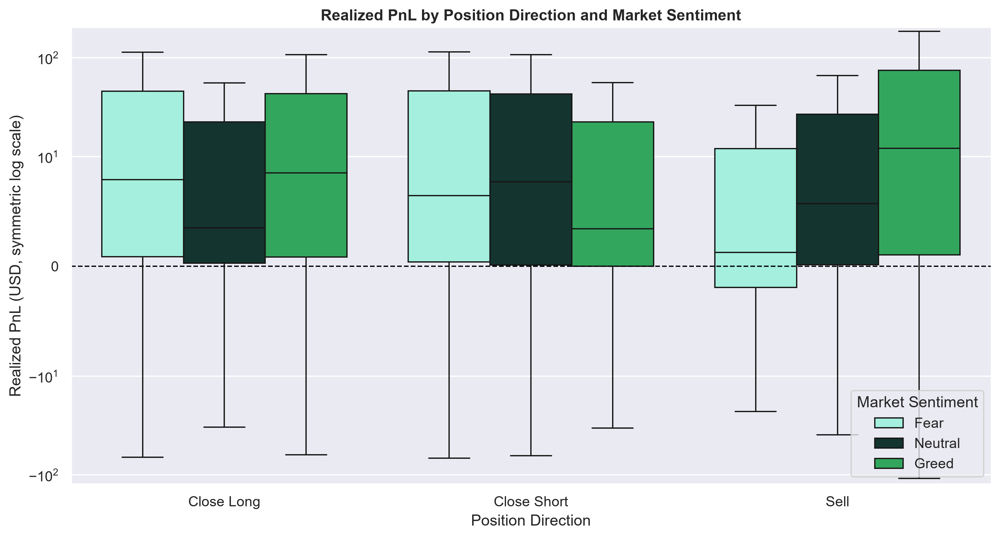</p>

- **Close Long:** median PnL is positive in all three sentiments, higher in Greed and Fear than in Neutral.
- **Close Short:** Fear and Neutral have higher medians than Greed.
- **Sell:** median PnL is lowest in Fear, higher in Neutral, highest in Greed.

Every direction shows outcomes on both sides of break-even.

---
### 📘 Report Preview

One-page dashboards from the three analysis reports. Click an image to open its PDF.

#### 🔹 Univariate analysis

<a href="reports/univarient_analysis_report.pdf">
  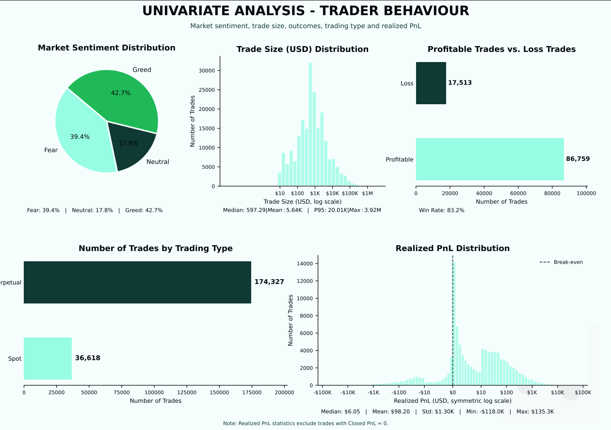
</a>

#### 🔹 Bivariate analysis

<a href="reports/bivarient_analysis_report.pdf">
  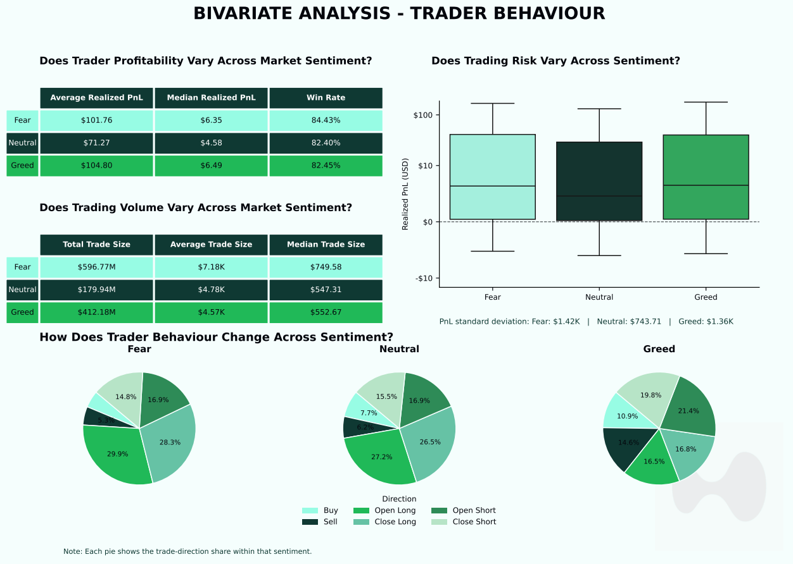
</a>

#### 🔹 Multivariate analysis

<a href="reports/multivarient_analysis_report.pdf">
  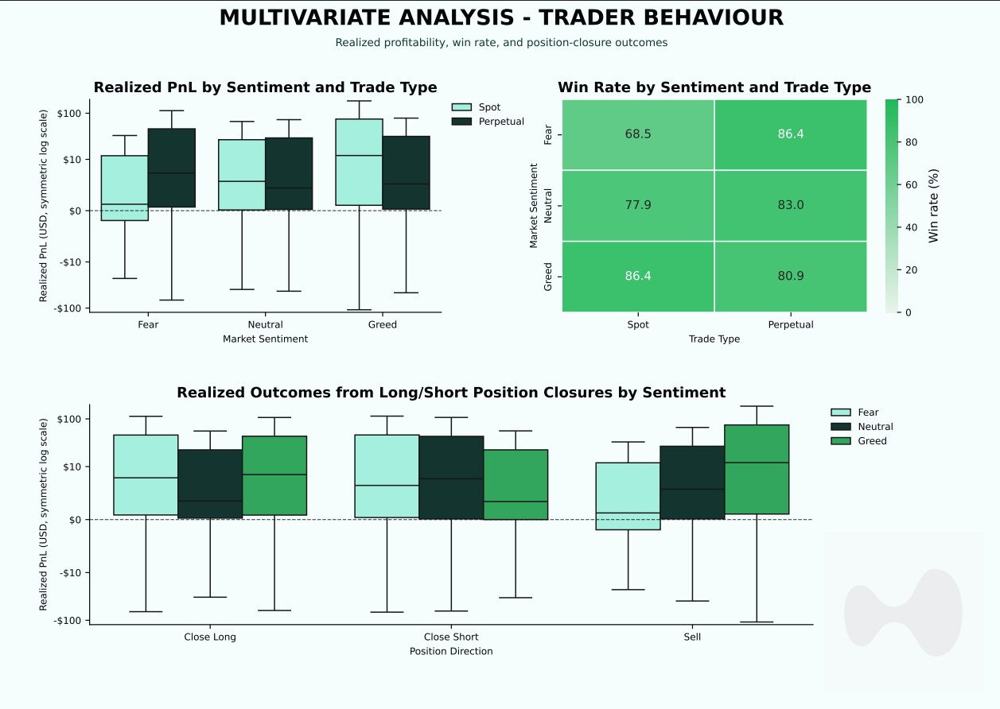
</a>

📄 [Open the full report (PDF)](Trading_Behaviour_Analysis_Report.pdf)

---


## 💡 Key Insights

1. **Activity differed across sentiment.** Fear had the highest total volume ($596.77M, against $412.18M in Greed and $179.94M in Neutral) and the highest median trade size ($749.58).
2. **Profitability varied, but win rates stayed close.** Mean realized PnL was $101.76 (Fear), $71.27 (Neutral) and $104.80 (Greed). Win rates were 84.43%, 82.40% and 82.45%.
3. **Variability was higher in Fear and Greed.** PnL standard deviation was about $1,420 in Fear, $1,360 in Greed and $744 in Neutral.
4. **Trade direction shifted.** Long actions led in Fear and Neutral. Short actions took a larger combined share in Greed.
5. **Spot and Perpetual behaved differently.** Perpetual had the higher win rate in Fear (86.36% vs 68.46%) and Neutral (83.05% vs 77.89%). Spot led in Greed (86.44% vs 80.88%).
6. **Position direction adds context.** Close Long, Close Short and Sell have different medians and spreads under each sentiment, so sentiment alone doesn't explain the variation in outcomes.

---

## ✅ Conclusion

Trader behaviour and outcomes are not uniform across market sentiment. Fear showed the highest volume and median trade size. Fear and Greed showed more variable PnL than Neutral. Profitability measures differed, though win rates stayed close. Long-related actions dominated in Fear and Neutral, and Short-related actions in Greed.

Trading type and position direction add detail to this picture: Spot and Perpetual follow different median PnL and win-rate patterns across sentiment, and the PnL distribution changes with position direction.

---

## 📝 Interpretation Note

This analysis finds **associations and observed patterns, not causal relationships.** Higher trading volume during Fear does not show that Fear caused traders to trade bigger. Differences in realized PnL across sentiment shouldn't be read as sentiment directly causing profitability to change. The findings describe patterns in the analysed Hyperliquid data after joining it with the daily sentiment classification.

---

## 📁 Project Structure

```text
Trading-Behaviour-Analysis/
├── README.md
├── main.py                              # runs the full workflow
├── transform_df.py                      # cleaning and feature engineering
├── univariate_analysis_report.py
├── bivariate_analysis_report.py
├── multivariate_analysis_report.py
├── project.ipynb                        # exploratory notebook
├── hyperliquid_logo.webp
├── csv_files/
│   ├── fear_greed_index.csv
│   └── historical_data.csv
├── charts/                              # images used in this README
└── reports/
    ├── univariate_analysis_report.pdf
    ├── bivariate_analysis_report.pdf
    ├── multivariate_analysis_report.pdf
    └── Trading_Behaviour_Analysis_Report.pdf
```

---

## 🧩 Script Breakdown

Data transformation is kept separate from the analysis stages, so each part can be rerun on its own.

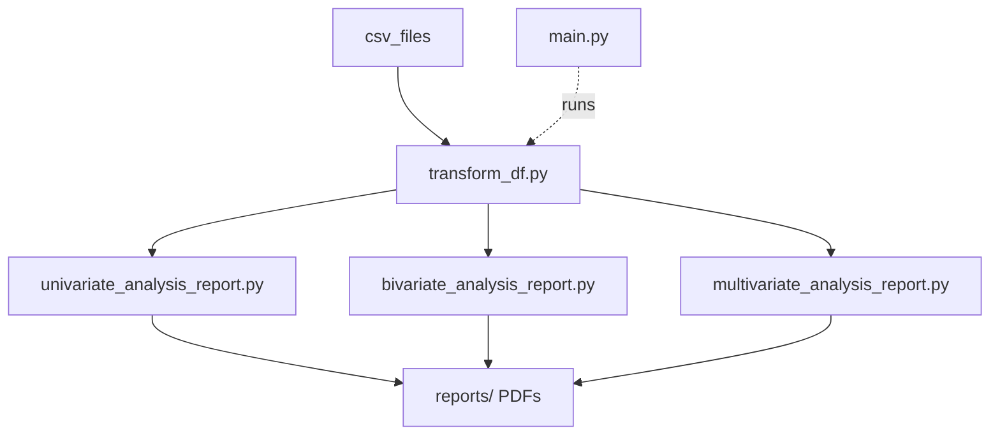

| File | Role |
| --- | --- |
| `main.py` | Entry point. Runs the full reporting pipeline and saves the PDFs into `reports/`. |
| `transform_df.py` | Data preparation layer used by every analysis script. |
| `univariate_analysis_report.py` | Generates the univariate report. |
| `bivariate_analysis_report.py` | Generates the bivariate report. |
| `multivariate_analysis_report.py` | Generates the multivariate report. |
| `project.ipynb` | Initial exploratory analysis and experimentation. |

<details>
<summary><b>What each script does</b></summary>

**`transform_df.py`**
- loads the sentiment and trade datasets
- normalizes date fields
- filters valid trading directions
- merges the datasets on date
- creates derived features: `classification`, `trade_type`, `position_type`, `proxy_name`
- returns the clean DataFrame used across the pipeline

**`univariate_analysis_report.py`**
- sentiment distribution
- trade size distribution
- realized PnL distribution
- profitable vs. loss trade counts
- Spot vs. Perpetual activity

**`bivariate_analysis_report.py`**
- realized PnL by sentiment
- trade size by sentiment
- profit and win rate differences across sentiment
- direction-based changes across sentiment

**`multivariate_analysis_report.py`**
- realized PnL by sentiment and trade type
- win rate by sentiment and trade type
- outcomes by position closure and direction

**`main.py`**
- orchestrates the whole run and writes the PDF files to `reports/`

</details>

---

## 🔧 Tools and Technologies

| | |
| --- | --- |
| **Language and libraries** | Python, Pandas, NumPy |
| **Visualization** | Matplotlib, Seaborn |
| **Environment** | Jupyter Notebook |
| **Techniques** | Data cleaning and transformation, univariate / bivariate / multivariate analysis, distribution analysis, grouped aggregation, profitability analysis, risk and variability analysis, behavioural analysis |
| **Output** | PDF analytical reports, charts, a reproducible Python workflow |

---

## 🚀 How to Run

**1. Clone the repository**

```bash
git clone <your-repository-url>
cd Trading-Behaviour-Analysis
```

**2. Create a virtual environment**

```bash
python -m venv .venv
```

Windows:

```bash
.venv\Scripts\activate
```

macOS / Linux:

```bash
source .venv/bin/activate
```

**3. Install dependencies**

```bash
python -m pip install --upgrade pip
pip install pandas numpy matplotlib seaborn jupyter notebook pillow
```

**4. Run the full workflow**

```bash
python main.py
```

This regenerates the PDF reports in `reports/`.

**5. Open the notebook (optional)**

```bash
jupyter notebook project.ipynb
```

---

## 📄 Reports

| Report | File |
| --- | --- |
| Full report | [Trading_Behaviour_Analysis_Report.pdf](Trading_Behaviour_Analysis_Report.pdf) |
| Univariate analysis | [univariate_analysis_report.pdf](reports/univarient_analysis_report.pdf) |
| Bivariate analysis | [bivariate_analysis_report.pdf](reports/bivarient_analysis_report.pdf) |
| Multivariate analysis | [multivariate_analysis_report.pdf](reports/multivarient_analysis_report.pdf) |

The full report covers Background, Business Problem, Objective, Datasets, Methodology, Exploratory Data Analysis, Key Insights and Conclusion.

---

## 👤 Author

**Nani Babu**
Data Analytics | Python | SQL | Power BI | Excel
